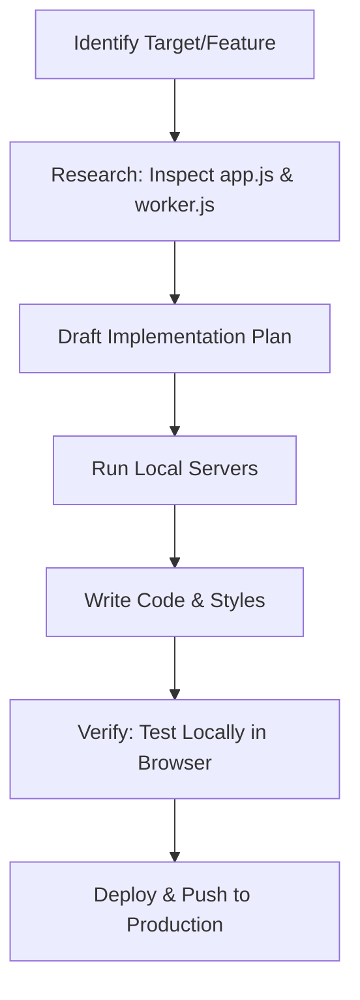

# NeonSkull Cyber-Chess — Development & Improvement Workflow

This guide establishes the recommended local development workflow, testing procedures, deployment steps, and a feature roadmap for upgrading the NeonSkull Cyber-Chess platform.

---

## 1. Local Development Setup

To test changes to the frontend (`index.html`, `app.js`, `style.css`) and backend (`worker.js`) concurrently, set up a local split-environment.

### A. Local Backend Server (Wrangler)
The backend runs as a Cloudflare Worker using Durable Objects and KV. You can run it locally with Wrangler's emulation:

```bash
# Start the local Worker dev server
npx wrangler dev
```

> [!NOTE]
> Wrangler will spin up a local server (typically at `http://localhost:8787`). It will also emulate the `USERS_KV` namespace and the `LobbyRoom` Durable Object locally.

### B. Local Frontend Server
Since the frontend consists of static assets, serve them with a lightweight development server to support auto-reload and avoid CORS issue:

```bash
# Option 1: Node.js (highly recommended for live-reloads)
npx live-server

# Option 2: Python 3
python -m http.server 8000
```
Then open `http://localhost:8080` (or `http://localhost:8000`) in your browser.

### C. Linking Frontend & Backend Locally
In `app.js`, update the server endpoint configuration to point to your local Wrangler instance during development:
```javascript
const CF_WORKER_URL = 'http://localhost:8787';
```

---

## 2. Iterative Feature Workflow (The Planning Loop)

When introducing new features or refactoring the code, use this structured process:



### Step 1: Research & Scope
- **Frontend Changes**: Look at `app.js` and `style.css`.
- **Backend Changes**: Look at `worker.js` (e.g., adding REST APIs or Durable Object socket message handlers).

### Step 2: Implementation Checklist (`task.md`)
Create a temporary `task.md` file to track sub-tasks:
```markdown
- [ ] Implement REST API in worker.js
- [ ] Connect frontend UI trigger in app.js
- [ ] Style new components in style.css
- [ ] Manual test: Verify E2E connection
```

### Step 3: Local Verification
1. Open the browser's developer console (F12) to monitor WebSocket frames and network requests.
2. Verify all UI element layouts on mobile and desktop viewports.
3. Test edge cases (e.g., disconnects, invalid moves, expired sessions).

### Step 4: Production Deployment
Once verified locally:
1. **Deploy backend worker**:
   ```bash
   npx wrangler deploy
   ```
2. **Deploy frontend static files**:
   Push the latest changes to your GitHub repository. GitHub Pages will build and deploy the frontend automatically.
   ```bash
   git add .
   git commit -m "feat: implement chess improvements"
   git push origin main
   ```

---

## 3. High-Priority Feature Backlog

Here are key areas you can target next to upgrade the site, along with how to implement them:

### 🧩 Feature A: Enhanced Matchmaking Queue
Currently, challenges are sent manually to specific online users.
- **Goal**: Implement a "Quick Play" matching queue.
- **Backend**: Add a queue state array to the `LobbyRoom` Durable Object. When a player clicks "Find Match", add them to the queue and automatically match them with the closest Elo rating.
- **Frontend**: Add a "Quick Match" matchmaking overlay with a queuing timer.

### 🔊 Feature B: Audio Board Sounds
Add tactile sensory immersion to the board.
- **Goal**: Play synthesizer or laser sounds when pieces are moved, captured, or put in check.
- **Frontend**: Load small audio assets (e.g., standard `.mp3` or synthesized audio contexts) in `app.js`. Trigger them inside the piece movement transition handlers.

### 💾 Feature C: Offline Mode & Game Cache
Improve responsiveness and reliability.
- **Goal**: Cache puzzles and past game history in local storage.
- **Frontend**: Use `localStorage` in `app.js` to store solved puzzle counts and ELO rating so users can see their stats immediately even if the network is slow.

### 🧪 Feature D: Automated Integration Testing
Ensure new updates do not break chess logic or auth.
- **Goal**: Set up a headless browser test suite.
- **Action**: Initialize a Vitest/Playwright config. Write an end-to-end test script to simulate user login, friend requests, and standard chess games.
